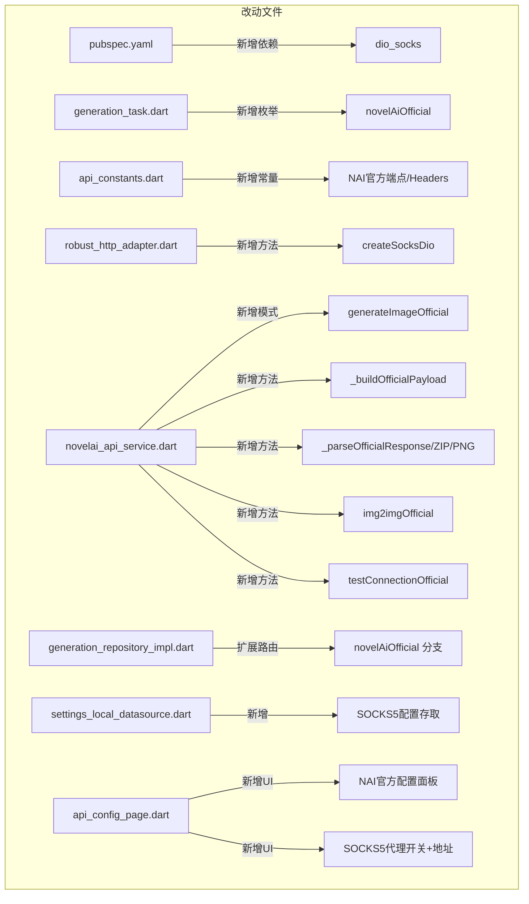

# NAI-WorldPainter（绘世）完整改造方案

> 本文档位于项目开发区内，供改造实施全流程参考。
> 最后更新：2026-06-02

---

## 一、改造目标

为 NAI-WorldPainter App 增加 **NovelAI 官方 API 直连能力**，支持通过 **SOCKS5 代理** 经 VPN 访问官方接口。

### 核心能力变更

| 当前能力 | 改造后能力 |
|----------|-----------|
| 仅支持 OpenAI 兼容格式（中转站） | ✅ 新增 NovelAI 官方原生格式 |
| 中转站转发（无法直连 NovelAI） | ✅ 可直连 `image.novelai.net` |
| 无代理支持 | ✅ 新增 SOCKS5 代理配置 |
| 响应为 JSON → Markdown 图片 URL | ✅ 直接接收 ZIP/PNG 图片二进制 |

---

## 二、现状分析

### 2.1 项目架构总览

```
nai_huishi/
├── lib/
│   ├── core/
│   │   ├── constants/api_constants.dart     # API 端点/参数常量
│   │   ├── network/robust_http_adapter.dart  # Dio 实例工厂（DoH DNS）
│   │   └── di/injection.dart                 # 依赖注入
│   ├── domain/
│   │   ├── entities/
│   │   │   ├── generation_task.dart         # 生图任务 + ImageProviderType 枚举
│   │   │   ├── nai_model.dart               # 模型实体
│   │   │   └── api_endpoint.dart            # API 端点配置
│   ├── data/
│   │   ├── datasources/remote/
│   │   │   ├── novelai_api_service.dart     # ← 核心：当前用 OpenAI 格式
│   │   │   ├── gpt_api_service.dart         # GPT 图片 API
│   │   │   └── nano_banana_api_service.dart # NanoBanana API
│   │   ├── datasources/local/
│   │   │   └── settings_local_datasource.dart # 本地设置存储
│   │   └── repositories/
│   │       └── generation_repository_impl.dart # 路由分发
│   └── presentation/
│       ├── pages/
│       │   └── api_config_page.dart         # API 配置 UI
│       └── viewmodels/
│           └── generation_viewmodel.dart    # 生图 VM
└── pubspec.yaml                             # 依赖管理
```

### 2.2 NovelAiApiService 当前调用链路（OpenAI 格式）

```dart
generateImage(task, apiKey, baseUrl)
  → _configureAuth() → Authorization: Bearer xxx
  → _buildChatCompletionsBody(task)
    → messages: [{role:user, content: JSON prompt}, {role:system, Negative prompt:...}]
    → 顶层参数: model, scale, cfg_rescale, width, height, sampler, noise_schedule
  → POST /v1/chat/completions
  → _parseResponse() → choices[0].message.content → 提取图片 URL
```

### 2.3 现有网络层（robust_http_adapter.dart）

```dart
createRobustDio() → IOHttpClientAdapter 包含：
  - DoH DNS 解析（阿里/腾讯/360）
  - IPv4 优先
  - 宽松 TLS（badCertificateCallback → true）
  - 全量日志拦截器
```

> ⚠️ **当前缺陷**：不支持 SOCKS5 代理，无法通过 VPN 访问被墙的 NovelAI 官方 API。

### 2.4 NovelAI 官方 API 格式（参考生图插件）

```json
POST https://image.novelai.net/ai/generate-image
Headers: Authorization, Content-Type: application/json,
         Accept: application/zip,
         Origin: https://novelai.net,
         Referer: https://novelai.net

{
  "input": "1girl",
  "model": "nai-diffusion-4-5-curated",
  "action": "generate",
  "parameters": {
    "width": 832, "height": 1216,
    "scale": 5.0, "steps": 28,
    "sampler": "k_euler", "noise_schedule": "karras",
    "seed": 123456789, "n_samples": 1,
    "ucPreset": 0, "qualityToggle": true,
    "params_version": 3, "cfg_rescale": 0.7,
    "negative_prompt": "lowres",
    "v4_prompt": {
      "caption": {"base_caption": "1girl", "char_captions": []},
      "use_coords": true, "use_order": true
    },
    "v4_negative_prompt": {
      "caption": {"base_caption": "lowres", "char_captions": []},
      "legacy_uc": false
    },
    "characterPrompts": [],
    "reference_image_multiple": [],
    "reference_information_extracted_multiple": [],
    "reference_strength_multiple": []
  }
}

响应: ZIP 二进制 (PK\x03\x04) 内含 PNG，或直接 PNG (\x89PNG)
```

---

## 三、改造方案

### 3.1 总体设计

采用**渠道扩展模式**——在现有 `ImageProviderType` 枚举中新增 `novelAiOfficial`，沿袭已有架构的 API 类型分发逻辑。

```
用户选择 API 类型
├── novelAi         → NovelAiApiService（OpenAI Chat Completions → 中转站）
├── novelAiOfficial → NovelAiApiService（NAI 原生格式 → NovelAI 官方）
│                      SOCKS5 代理可选 → VPN → image.novelai.net
├── gpt             → GptApiService
└── nanoBanana      → NanoBananaApiService
```

### 3.2 架构改动全景



### 3.3 详细改动清单

#### 改动 ①：`pubspec.yaml` — 新增 SOCKS5 依赖

```yaml
dependencies:
  dio_socks: ^0.0.4      # 为 Dio 提供 SOCKS5 代理能力
```

#### 改动 ②：`generation_task.dart` — 新增渠道枚举

```dart
enum ImageProviderType {
  novelAi,           // 已有：OpenAI 兼容格式（中转站）
  novelAiOfficial,   // 新增：直连 NAI 官方 API
  gpt,
  nanoBanana,
}
```

#### 改动 ③：`api_constants.dart` — 新增 NAI 官方常量

```dart
class ApiConstants {
  // ... 已有常量不变 ...

  // === 新增：NovelAI 官方 API ===
  static const String naiGenerateImage = '/ai/generate-image';
  static const String naiEncodeVibe = '/ai/encode-vibe';

  // NAI 官方请求必须携带的 Headers
  static const Map<String, String> naiOfficialHeaders = {
    'Accept': 'application/zip',
    'Origin': 'https://novelai.net',
    'Referer': 'https://novelai.net',
    'User-Agent': 'Mozilla/5.0 (Windows NT 10.0; Win64; x64) '
        'AppleWebKit/537.36 (KHTML, like Gecko) Chrome/143.0.0.0 Safari/537.36',
  };

  // V4 模型固定参数
  static const int defaultParamsVersion = 3;
  static const bool defaultQualityToggle = true;
  static const bool defaultPreferBrownian = true;

  // SOCKS5 默认值
  static const String defaultSocks5Host = '127.0.0.1';
  static const int defaultSocks5Port = 10808;
}
```

#### 改动 ④（核心）：`robust_http_adapter.dart` — 新增 SOCKS5 Dio 工厂

在文件末尾新增：

```dart
import 'package:dio_socks/dio_socks.dart';

/// 创建带 SOCKS5 代理的 Dio 实例（用于 NAI 官方 API + VPN）
Dio createSocksDio({
  required String proxyHost,
  required int proxyPort,
  String? proxyUsername,
  String? proxyPassword,
}) {
  final dio = Dio();

  // Socks5Helper 自动处理 SOCKS5 握手/认证/转发
  dio.httpClientAdapter = Socks5Helper(
    Socks5Proxy(
      proxyHost,
      proxyPort,
      username: proxyUsername,
      password: proxyPassword,
    ),
    // 建议 5 分钟超时，NAI 生图较慢
    connectionTimeout: const Duration(seconds: 15),
  );

  // 日志拦截器（与原 Dio 保持一致）
  dio.interceptors.add(InterceptorsWrapper(
    onRequest: (options, handler) {
      debugPrint('[SOCKS5] >>> ${options.method} ${options.baseUrl}${options.path}');
      handler.next(options);
    },
    onResponse: (response, handler) {
      debugPrint('[SOCKS5] <<< ${response.statusCode}');
      handler.next(response);
    },
    onError: (error, handler) {
      debugPrint('[SOCKS5] !!! ${error.type} ${error.message}');
      handler.next(error);
    },
  ));

  return dio;
}
```

#### 改动 ⑤（核心）：`novelai_api_service.dart` — 新增 NAI 官方模式

需要新增以下方法：

```dart
// ═══════════════════════════════════════════
//  NovelAI 官方 API 模式
// ═══════════════════════════════════════════

/// 配置 NAI 官方认证（含 Origin/Referer）
void _configureOfficialAuth(String apiKey, String baseUrl) {
  final normalized = baseUrl.trim().replaceAll(RegExp(r'/+$'), '');
  _dio.options.baseUrl = normalized;
  _dio.options.headers['Authorization'] = 'Bearer $apiKey';
  _dio.options.headers['Content-Type'] = 'application/json';
  ApiConstants.naiOfficialHeaders.forEach((k, v) {
    _dio.options.headers[k] = v;
  });
}

/// 官方文生图
Future<GenerationTask> generateImageOfficial(
  GenerationTask task,
  String apiKey,
  String baseUrl, {
  bool useProxy = false,
  String proxyHost = '127.0.0.1',
  int proxyPort = 10808,
}) async {
  final dio = useProxy
      ? createSocksDio(proxyHost: proxyHost, proxyPort: proxyPort)
      : _dio;

  _configureOfficialAuth(apiKey, baseUrl);
  final requestBody = _buildOfficialPayload(task);

  final response = await dio.post(
    ApiConstants.naiGenerateImage,
    data: requestBody,
    options: Options(
      receiveTimeout: const Duration(minutes: 5),
      responseType: ResponseType.bytes, // ← 关键：二进制
    ),
  );

  return _parseOfficialResponse(response.data as List<int>, task);
}

/// 构造 NAI 官方请求体
Map<String, dynamic> _buildOfficialPayload(GenerationTask task) {
  final isV4 = task.model.contains('diffusion-4');
  final parameters = <String, dynamic>{
    'width': task.width,
    'height': task.height,
    'scale': task.scale,
    'steps': 28,
    'sampler': task.sampler,
    'seed': task.seed ?? Random().nextInt(999999999),
    'n_samples': 1,
    'ucPreset': 0,
    'qualityToggle': true,
    'sm': false,
    'sm_dyn': false,
    'noise_schedule': task.noiseSchedule,
  };

  if (isV4) {
    final mergedNegative = task.negativePrompt ?? '';
    parameters.addAll({
      'params_version': 3,
      'cfg_rescale': task.cfgRescale,
      'autoSmea': false,
      'legacy': false,
      'prefer_brownian': true,
      'negative_prompt': mergedNegative,
      'v4_prompt': {
        'caption': {
          'base_caption': task.prompt,
          'char_captions': _buildOfficialCharCaptions(task.characters),
        },
        'use_coords': (task.characters != null && task.characters!.isNotEmpty),
        'use_order': true,
      },
      'v4_negative_prompt': {
        'caption': {
          'base_caption': mergedNegative,
          'char_captions': _buildOfficialCharUcCaptions(task.characters),
        },
        'legacy_uc': false,
      },
      'characterPrompts': _buildOfficialCharacterPrompts(task.characters),
      'reference_image_multiple': [],
      'reference_information_extracted_multiple': [],
      'reference_strength_multiple': [],
    });
  } else {
    parameters['negative_prompt'] = task.negativePrompt ?? '';
  }

  return {
    'input': task.prompt,
    'model': task.model,
    'action': 'generate',
    'parameters': parameters,
  };
}

/// 解析官方响应（ZIP/PNG 二进制 → 保存到本地）
Future<GenerationTask> _parseOfficialResponse(
  List<int> bytes,
  GenerationTask originalTask,
) async {
  try {
    final data = Uint8List.fromList(bytes);
    if (data.length < 4) throw FormatException('响应过短');

    final magic0 = data[0];
    final magic1 = data[1];
    final magic2 = data[2];
    final magic3 = data[3];

    // ZIP: PK\x03\x04
    if (magic0 == 0x50 && magic1 == 0x4B && magic2 == 0x03 && magic3 == 0x04) {
      final imageBytes = _extractPngFromZip(data);
      if (imageBytes != null) {
        return await _saveImageBytes(imageBytes, originalTask);
      }
    }

    // PNG: \x89PNG
    if (magic0 == 0x89 && magic1 == 0x50 && magic2 == 0x4E && magic3 == 0x47) {
      return await _saveImageBytes(data, originalTask);
    }

    throw FormatException('未知响应格式: $magic0 $magic1 $magic2 $magic3');
  } catch (e) {
    return originalTask.copyWith(
      status: 'failed',
      errorMessage: '解析官方响应失败: $e',
      completedAt: DateTime.now(),
    );
  }
}

/// 从 ZIP 中提取第一张 PNG
Uint8List? _extractPngFromZip(Uint8List zipBytes) {
  // 简单 ZIP 解析：查找 PNG magic 并提取
  final pngStart = 0x89504E47; // PNG magic as int
  for (int i = 0; i < zipBytes.length - 4; i++) {
    if (zipBytes[i] == 0x89 && zipBytes[i + 1] == 0x50 &&
        zipBytes[i + 2] == 0x4E && zipBytes[i + 3] == 0x47) {
      final pngEnd = zipBytes.indexOf(0x49, i + 4); // IEND chunk
      if (pngEnd != -1) {
        return zipBytes.sublist(i, pngEnd + 4);
      }
      return zipBytes.sublist(i);
    }
  }
  return null;
}

/// 保存图片到本地
Future<GenerationTask> _saveImageBytes(
  Uint8List imageBytes,
  GenerationTask originalTask,
) async {
  final filename = ImageUtils.generateFilename();
  final dir = await ImageUtils.getImageDirectory();
  final filePath = '${dir.path}/$filename';
  await File(filePath).writeAsBytes(imageBytes);
  return originalTask.copyWith(
    status: 'success',
    imagePath: filePath,
    completedAt: DateTime.now(),
  );
}

/// 官方图生图
Future<GenerationTask> img2imgOfficial(
  GenerationTask task,
  String apiKey,
  String baseUrl, {
   bool useProxy = false, String proxyHost = '127.0.0.1', int proxyPort = 10808,
}) async {
  final dio = useProxy
      ? createSocksDio(proxyHost: proxyHost, proxyPort: proxyPort)
      : _dio;

  _configureOfficialAuth(apiKey, baseUrl);

  final sourceBytes = await File(task.sourceImagePath!).readAsBytes();
  final payload = _buildOfficialPayload(task);
  payload['action'] = 'img2img';
  payload['parameters']['image'] = base64Encode(sourceBytes);
  payload['parameters']['strength'] = task.inpaintStrength ?? 0.7;
  payload['parameters']['noise'] = 0.0;

  final response = await dio.post(
    ApiConstants.naiGenerateImage,
    data: payload,
    options: Options(
      receiveTimeout: const Duration(minutes: 5),
      responseType: ResponseType.bytes,
    ),
  );
  return _parseOfficialResponse(response.data as List<int>, task);
}

/// 连接测试（走官方 API）
Future<bool> testConnectionOfficial(
  String apiKey,
  String baseUrl, {
  bool useProxy = false, String proxyHost = '127.0.0.1', int proxyPort = 10808,
}) async {
  final dio = useProxy
      ? createSocksDio(proxyHost: proxyHost, proxyPort: proxyPort)
      : _dio;
  _configureOfficialAuth(apiKey, baseUrl);
  try {
    final response = await dio.post(
      ApiConstants.naiGenerateImage,
      data: {
        'input': '1girl',
        'model': 'nai-diffusion-4-5-curated',
        'action': 'generate',
        'parameters': {
          'width': 832, 'height': 1216,
          'scale': 5.0, 'steps': 28,
          'sampler': 'k_euler', 'noise_schedule': 'karras',
          'seed': 1, 'n_samples': 1, 'ucPreset': 0,
          'qualityToggle': true,
        },
      },
      options: Options(
        receiveTimeout: const Duration(seconds: 20),
        responseType: ResponseType.bytes,
      ),
    );
    return response.statusCode == 200;
  } catch (_) {
    return false;
  }
}
```

#### 改动 ⑥：`generation_repository_impl.dart` — 扩展路由

```dart
class GenerationRepositoryImpl implements GenerationRepository {
  final NovelAiApiService _apiService;
  final GptApiService _gptApiService;
  final NanoBananaApiService _nanoApiService;
  final SettingsRepository _settingsRepo;

  GenerationRepositoryImpl({...});

  Future<GenerationTask> generateImage(GenerationTask task) async {
    final settings = await _settingsRepo.getApiSettings();

    switch (task.providerType) {
      case ImageProviderType.novelAiOfficial:
        // 读取代理配置
        final proxy = await _settingsRepo.getSocks5Proxy();
        return _apiService.generateImageOfficial(
          task,
          settings.apiKey,
          settings.baseUrl,
          useProxy: proxy.enabled,
          proxyHost: proxy.host,
          proxyPort: proxy.port,
        );

      case ImageProviderType.novelAi:
        return _apiService.generateImage(task, settings.apiKey, settings.baseUrl);

      case ImageProviderType.gpt:
        return _gptApiService.generateImage(task, settings.apiKey, settings.baseUrl);

      case ImageProviderType.nanoBanana:
        return _nanoApiService.generateImage(task, settings.apiKey, settings.baseUrl);
    }
  }
}
```

#### 改动 ⑦：`settings_local_datasource.dart` — 新增 SOCKS5 存取

```dart
class SettingsLocalDatasource {
  // ... 已有方法 ...

  // === 新增：SOCKS5 代理配置 ===

  Future<void> setSocks5Enabled(bool enabled) async =>
      _prefs.setBool('socks5_enabled', enabled);

  bool getSocks5Enabled() =>
      _prefs.getBool('socks5_enabled') ?? false;

  Future<void> setSocks5Host(String host) async =>
      _prefs.setString('socks5_host', host);

  String getSocks5Host() =>
      _prefs.getString('socks5_host') ?? ApiConstants.defaultSocks5Host;

  Future<void> setSocks5Port(int port) async =>
      _prefs.setInt('socks5_port', port);

  int getSocks5Port() =>
      _prefs.getInt('socks5_port') ?? ApiConstants.defaultSocks5Port;

  Future<void> setSocks5Config({
    required bool enabled,
    required String host,
    required int port,
  }) async {
    await setSocks5Enabled(enabled);
    await setSocks5Host(host);
    await setSocks5Port(port);
  }
}
```

#### 改动 ⑧：`api_config_page.dart` — 新增 NAI 官方 + SOCKS5 配置 UI

需要在 API 配置页中增加：

1. **API 类型选择器**新增 `novelAiOfficial` 选项
2. **NAI 官方模式下的额外字段**：
   - `Base URL`（默认 `https://image.novelai.net`）
   - `API Key`（pst-xxx 格式）
3. **SOCKS5 代理开关**（仅在 NAI 官方模式下显示）
4. **SOCKS5 代理地址**（主机 + 端口，默认 `127.0.0.1:10808`）

```dart
// 伪代码示意
Widget _buildOfficialApiConfig() {
  return Column(
    children: [
      TextField(
        label: 'Base URL',
        hint: 'https://image.novelai.net',
        onChanged: (v) => viewModel.setBaseUrl(v),
      ),
      TextField(
        label: 'API Key',
        hint: 'pst-xxxxxxxxxxxxxxxxxx',
        obscureText: true,
        onChanged: (v) => viewModel.setApiKey(v),
      ),
      SwitchListTile(
        title: Text('SOCKS5 代理'),
        subtitle: Text('通过 VPN 连接 NovelAI 官方 API'),
        value: proxyEnabled,
        onChanged: viewModel.setSocks5Enabled,
      ),
      if (proxyEnabled) ...[
        TextField(
          label: '代理地址',
          hint: '127.0.0.1',
          onChanged: viewModel.setSocks5Host,
        ),
        TextField(
          label: '代理端口',
          hint: '10808',
          keyboardType: TextInputType.number,
          onChanged: (v) => viewModel.setSocks5Port(int.parse(v)),
        ),
      ],
      ElevatedButton(
        onPressed: () => viewModel.testConnection(),
        child: Text('测试连接'),
      ),
    ],
  );
}
```

---

## 四、SOCKS5 代理链路详解

### 4.1 流量路径

```
NAI-WorldPainter App
    │
    ├─ 无代理模式（useProxy=false）
    │    └─ Dio → 直连 image.novelai.net（国内无法访问）
    │
    └─ SOCKS5 模式（useProxy=true）
         └─ Dio → Socks5Helper
                └─ SOCKS5 握手 (127.0.0.1:10808)
                       └─ VPN 客户端 (Clash/V2Ray/SingBox...)
                              └─ 代理出口 → image.novelai.net:443
```

### 4.2 常见 VPN 客户端 SOCKS5 端口

| 客户端 | 默认 SOCKS5 端口 | 备注 |
|--------|:----------------:|------|
| v2rayNG | `10808` | 最常用的 Android VPN 客户端 |
| Clash Meta | `7890` (mixed) / `1080` (SOCKS) | 混合端口同时支持 HTTP/SOCKS |
| SingBox | `2080` (mixed) / `1080` (SOCKS) | 新一代代理内核 |
| Surge (iOS) | `1080` | iOS 平台 |

### 4.3 认证支持

`dio_socks` 的 `Socks5Proxy` 支持用户名密码认证：

```dart
Socks5Proxy(
  host,
  port,
  username: 'user',    // 可选
  password: 'pass',    // 可选
)
```

---

## 五、变更总览

### 5.1 文件改动统计

| 文件 | 改动类型 | 行数预估 |
|------|:--------:|:--------:|
| `pubspec.yaml` | 新增依赖 | +1 行 |
| `domain/entities/generation_task.dart` | 新增枚举 | +1 行 |
| `core/constants/api_constants.dart` | 新增常量 | +15 行 |
| `core/network/robust_http_adapter.dart` | 新增工厂 | +40 行 |
| `data/datasources/remote/novelai_api_service.dart` | **核心新增** | +220 行 |
| `data/datasources/local/settings_local_datasource.dart` | 新增存取 | +20 行 |
| `data/repositories/generation_repository_impl.dart` | 扩展路由 | +15 行 |
| `domain/repositories/settings_repository.dart` | 新增接口 | +5 行 |
| `data/repositories/settings_repository_impl.dart` | 新增实现 | +15 行 |
| `presentation/pages/api_config_page.dart` | 新增 UI | +60 行 |
| 合计 | **10 个文件** | ~**+392 行** |

### 5.2 新增依赖

| 包 | 版本 | 用途 |
|---|:----:|------|
| ✅ `dio_socks` 已移除 | — | 改用 `lib/core/network/socks5_adapter.dart` 纯 Dart 内置实现 |
| **零新增依赖** | — | SOCKS5 适配器基于 `dart:io` 原生 Socket 实现，无第三方包 |

---

## 六、实施路径

### 阶段一：基础设施（依赖 + 常量 + 枚举）

```
Step 1: pubspec.yaml 新增 dio_socks 依赖
Step 2: generation_task.dart 新增 novelAiOfficial 枚举
Step 3: api_constants.dart 新增 NAI 官方常量 + 默认代理配置
```

### 阶段二：网络层（SOCKS5 Dio 工厂）

```
Step 4: robust_http_adapter.dart 新增 createSocksDio() 工厂
```

### 阶段三：核心业务（NAI 官方 API 调用）

```
Step 5: novelai_api_service.dart 新增官方模式全套方法
  - _configureOfficialAuth()
  - generateImageOfficial()
  - _buildOfficialPayload()
  - _parseOfficialResponse()
  - img2imgOfficial()
  - testConnectionOfficial()
```

### 阶段四：持久化（代理配置）

```
Step 6: settings_local_datasource.dart 新增 SOCKS5 存取
Step 7: settings_repository.dart + impl 新增接口/实现
```

### 阶段五：路由分发

```
Step 8: generation_repository_impl.dart 扩展 novelAiOfficial 分支
```

### 阶段六：UI 配置页

```
Step 9: api_config_page.dart 新增 NAI 官方配置面板 + SOCKS5 开关
```

### 阶段七：验证

```
Step 10: 修改后编译检查
Step 11: testConnectionOfficial 连接测试
Step 12: 文生图 / 图生图功能验证
```

---

## 七、风险与注意事项

| 风险 | 影响 | 缓解措施 |
|------|------|----------|
| `dio_socks` 包可能不兼容最新 Dio | 编译失败 | 锁定 dio 版本或使用 socks5 原生实现 |
| NAI 官方 API 无标准模型列表端点 | 模型选择不可用 | 硬编码已知模型列表供用户选择 |
| ZIP 解析在 Flutter 中无标准库 | 解析复杂 | 使用简单 magic 查找而非完整解压 |
| SOCKS5 代理可能增加延迟 | 生成速度变慢 | 建议使用延迟较低的代理节点 |
| NAI 官方 API 对国内 IP 封锁 | 完全不可用 | 必须配合 VPN/SOCKS5 代理使用 |

---

## 八、附录：关键 API 差异对照

| 维度 | OpenAI 格式（当前） | NovelAI 原生（改造后） |
|------|:------------------:|:---------------------:|
| **端点** | `/v1/chat/completions` | `/ai/generate-image` |
| **请求结构** | `messages[]` 数组 | `input + parameters{}` 嵌套 |
| **额外 Headers** | 无 | `Origin` + `Referer` + `Accept: application/zip` |
| **响应类型** | JSON | ZIP / PNG 二进制 |
| **图生图** | multipart FormData | `action: img2img` + base64 |
| **模型列表** | `/v1/models` | 无标准端点（需硬编码） |
| **认证 Key** | 任意 OpenAI 格式 | NovelAI `pst-*` Key |
